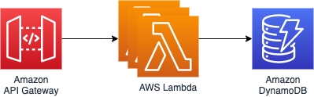

# Simple REST API using the Serverless Framework and LocalStack

This example demonstrates how to set up LocalStack for a simple REST API built with the [Serverless Framework](https://www.serverless.com/).

## Prerequisites
You need to have the following tools installed.

* LocalStack ([Install](https://localstack.cloud/docs/getting-started/installation/))
* Serverless ([Install](https://www.serverless.com/framework/docs/getting-started/))

## What is the Serverless Framework?
The Serverless Framework provides open source tooling to help you build, compile, and package code for serverless deployment in the cloud. Serverless deployment means that the application makes use of a number of hosted cloud services like AWS Lambda, DynamoDB, etc. instead of long-lived server applications that you manage and operate yourself.

The cloud provider takes care of the operation of these services, usually with horizontal scaling
available out of the box. That means, you can concentrate on the business logic of your application instead of having to worry about operation and scaling. Furthermore, services like AWS Lambda offer a very fine-grained payment model where you only pay for the computational time you actually use.       

## Setting up the Serverless app
The starting point for this guide is an [example Serverless service](https://www.serverless.com/examples/aws-python-rest-api-with-dynamodb/) acting as backend for a simple Todo app.

The service provides simple CRUD functionality exposed via a REST HTTP API. Under the hood the service uses an API Gateway in combination with a couple of Lambda functions that are connected to a DynamoDB table.



Below you find the project structure. It consists of a configuration file called `serverless.yml` and a separate directory containing all the todo operations.

```
├── package.json
├── serverless.yml
└── todos
    ├── __init__.py
    ├── create.py
    ├── decimalencoder.py
    ├── delete.py
    ├── get.py
    ├── list.py
    └── update.py
```

For each operation, exactly one file exists with exactly one function defined.

For example, the code for the delete-operation defined in `todos/delete.py` looks like this:
```python
import os

import boto3
dynamodb = boto3.resource('dynamodb')


def delete(event, context):
    table = dynamodb.Table(os.environ['DYNAMODB_TABLE'])

    # delete the todo from the database
    table.delete_item(
        Key={
            'id': event['pathParameters']['id']
        }
    )

    # create a response
    response = {
        "statusCode": 200
    }

    return response
```

Below you find the `serverless.yml` for the service. This file defines the required functions, endpoints, tables, permissions of the service.
```yaml
service: serverless-python-rest-api-with-dynamodb

frameworkVersion: ">=1.1.0 <=2.50.0"

provider:
  name: aws
  runtime: python3.8
  environment:
    DYNAMODB_TABLE: ${self:service}-${opt:stage, self:provider.stage}
  iamRoleStatements:
    - Effect: Allow
      Action:
        - dynamodb:Query
        - ...
      Resource: "arn:aws:dynamodb:${opt:region, self:provider.region}:*:table/${self:provider.environment.DYNAMODB_TABLE}"

functions:
  create:
    handler: todos/create.create
    events:
      - http:
          path: todos
          method: post
          cors: true

  ...

resources:
  Resources:
    TodosDynamoDbTable:
      Type: 'AWS::DynamoDB::Table'
      DeletionPolicy: Retain
      Properties:
        ...
        TableName: ${self:provider.environment.DYNAMODB_TABLE}
```

With the Serverless service set up, we can now easily deploy and teardown our service on the AWS cloud via the commands
`serverless deploy` and `serverless clean`, respectively. 

In the next step, we look at how we can integrate this Serverless setup with LocalStack. LocalStack provides a local, fully functional AWS cloud. This means you can deploy your applications on your local machine enabling faster development and testing cycles of your application.

## Setting up LocalStack
Setting up LocalStack for a Serverless app is fairly straightforward although it does require a few code changes.
In particular, it consists of the following two steps.

1. Installing and configuring the [Serverless-LocalStack plugin](https://github.com/localstack/serverless-localstack).
2. Adjusting AWS endpoints in Lambda functions.

### Installing and configuring the Serverless-LocalStack plugin
To install the plugin, execute the following command.
```
npm install -D serverless-localstack
```

Next, we set up the plugin in `serverless.yml`. For that simply add the following properties.
```yaml
...

plugins:
  - serverless-localstack

custom:
  localstack:
    stages:
      - local
```

This adds the LocalStack plugin to our Serverless setup but only activates the plugin for the stage "local". 
Next, we'll make minor adjustments to our function code in order to make our application work no matter if it is deployed on AWS or LocalStack.

### Adjusting AWS endpoints in Lambda functions.
The functions of our service make use of Boto3, [the AWS SDK for Python](https://github.com/boto/boto3) to interact 
with AWS services such as DynamoDB.

The code to set up a connection to DynamoDB looks like this:
```python
...
dynamodb = boto3.resource('dynamodb')
...
```

By default, this call attempts to create a connection via the usual AWS endpoints. However, when running our service in LocalStack, we need to make sure we create a connection via the LocalStack endpoint instead.

Usually, all of LocalStack's services are available via a specific port on localhost (e.g. `localhost:4566`). However, this endpoint only works when accessing LocalStack from outside its Docker runtime. 

Since the Lambda functions execute within the LocalStack Docker container, Lambda functions cannot access other services via the usual localhost endpoint. Instead, LocalStack provides a special environment variable `LOCALSTACK_HOSTNAME` which contains the internal endpoint of the LocalStack services from within its runtime environment.

Hence, we configure the Lambda function to use `LOCALSTACK_HOSTNAME` to detect whether it's executing in LocalStack and if yes, to adjust the DynamoDB endpoint accordingly:

```python
...
if 'LOCALSTACK_HOSTNAME' in os.environ:
    dynamodb_endpoint = 'http://%s:4566' % os.environ['LOCALSTACK_HOSTNAME']
    dynamodb = boto3.resource('dynamodb', endpoint_url=dynamodb_endpoint)
else:
    dynamodb = boto3.resource('dynamodb')
...
```

> Ideally, we want to make LocalStack's Lambda execution environment "LocalStack-agnostic", so that you are not required to adjust endpoints in your function code anymore. You want to help us with that? [Drop us a line in Slack](https://localstack-community.slack.com)!.

## Deploy to LocalStack

Start LocalStack by running
```bash
localstack start
```

Then to deploy the endpoint simply run
```bash
serverless deploy --stage local
```

The expected result should be similar to:

```bash
Serverless: Packaging service...
Serverless: Excluding development dependencies...
Serverless: Creating Stack...
Serverless: Checking Stack create progress...
........
Serverless: Stack create finished...
Serverless: Uploading CloudFormation file to S3...
Serverless: Uploading artifacts...
Serverless: Uploading service serverless-python-rest-api-with-dynamodb.zip file to S3 (38.3 KB)...
Serverless: Validating template...
Serverless: Skipping template validation: Unsupported in Localstack
Serverless: Updating Stack...
Serverless: Checking Stack update progress...
.....................................
Serverless: Stack update finished...
Service Information
service: serverless-python-rest-api-with-dynamodb
stage: local
region: us-east-1
stack: serverless-python-rest-api-with-dynamodb-local
resources: 35
api keys:
  None
endpoints:
  http://localhost:4566/restapis/XXXXXXXXXX/local/_user_request_
functions:
  create: serverless-python-rest-api-with-dynamodb-local-create
  list: serverless-python-rest-api-with-dynamodb-local-list
  get: serverless-python-rest-api-with-dynamodb-local-get
  update: serverless-python-rest-api-with-dynamodb-local-update
  delete: serverless-python-rest-api-with-dynamodb-local-delete
layers:
  None
```

Note the endpoint `http://localhost:4566/restapis/XXXXXXXXXX/local/_user_request_`. We can use this endpoint to interact with our service as demonstrated in the next section. 

## Usage

You can create, retrieve, update, or delete todos with the following commands:

### Create a Todo

```bash
curl -X POST http://localhost:4566/restapis/XXXXXXXXXX/local/_user_request_/todos --data '{ "text": "Integrate LocalStack with Serverless" }'
```

Example output:
```bash
{"id": "75f985a3-da8d-11eb-ac2f-3d8921573ad2", "text": "Integrate LocalStack with Serverless", "checked": false, "createdAt": "1625158666.9241908", "updatedAt": "1625158666.9241908"}%
```

### List all Todos

```bash
curl http://localhost:4566/restapis/XXXXXXXXXX/local/_user_request_/todos
```

Example output:
```bash
[{"checked": false, "createdAt": "1625158666.9241908", "id": "75f985a3-da8d-11eb-ac2f-3d8921573ad2", "text": "Integrate LocalStack with Serverless", "updatedAt": "1625158666.9241908"}]%
```

### Get one Todo

```bash
# Replace the <id> part with a real id from your todos table
curl http://localhost:4566/restapis/XXXXXXXXXX/local/_user_request_/todos/<id>
```

Example Result:
```bash
{"checked": false, "createdAt": "1625158666.9241908", "id": "75f985a3-da8d-11eb-ac2f-3d8921573ad2", "text": "Integrate LocalStack with Serverless", "updatedAt": "1625158666.9241908"}%
```

### Update a Todo

```bash
# Replace the <id> part with a real id from your todos table
curl -X PUT http://localhost:4566/restapis/XXXXXXXXXX/local/_user_request_/todos/<id> --data '{ "text": "Integrate LocalStack with Serverless", "checked": true }'
```

Example Result:
```bash
{"createdAt": "1625158666.9241908", "checked": true, "id": "75f985a3-da8d-11eb-ac2f-3d8921573ad2", "text": "Integrate LocalStack with Serverless", "updatedAt": 1625158963638}%
```

### Delete a Todo

```bash
# Replace the <id> part with a real id from your todos table
curl -X DELETE http://localhost:4566/restapis/XXXXXXXXXX/local/_user_request_/todos/<id>
```

No output

## Remove the service
To remove the service simply run
```
serverless remove --stage local
```

When re-deploying the service to LocalStack, you may run into the following issue. 
```
 Serverless Error ----------------------------------------
 
  The serverless deployment bucket "serverless-python-rest-api-with-dynamodb-local-none-b971536a" does not exist. Create it manually if you want to reuse the CloudFormation stack "serverless-python-rest-api-with-dynamodb-local", or delete the stack if it is no longer required.
```

In this case, simply restart the LocalStack Docker container (`ctrl`+`C` and `localstack start`).

## Contributing
If you run into any issues, please [create an issue](https://github.com/localstack/serverless-python-rest-api-with-dynamodb/issues/new) or, even better, [submit a pull request](https://github.com/localstack/serverless-python-rest-api-with-dynamodb/pulls). 
